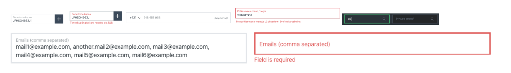

# WS task


## Demo
<a href="https://jakubtursky.sk/projekty/websupport/" target="_blank" title="WStask" class="link">Live demo</a>

## Task description




## Project setup

```
npm install
```

### Compiles and hot-reloads for development

```
npm run serve
```

### Compiles and minifies for production

```
npm run build
```

### Lints and fixes files

```
npm run lint
```

### Customize configuration

See [Configuration Reference](https://cli.vuejs.org/config/).

